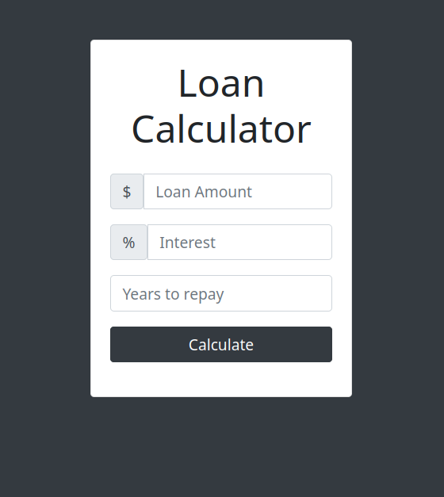

# Loan Calculator
A basic calculator to compute the monthly payments and total interest of a credit, given some initial amount and interest rate. (vanilla JavaScript, no JS frameworks).

Click [here](https://lifebalance.github.io/Loan-Calculator/) to see it **live**!

## Dependencies:

* [Bootstrap 4.6.0](https://getbootstrap.com/docs/4.0/getting-started/introduction/)

(JQuery and Popper.js are dependency of Bootstrap, but other than that, they're not used)
